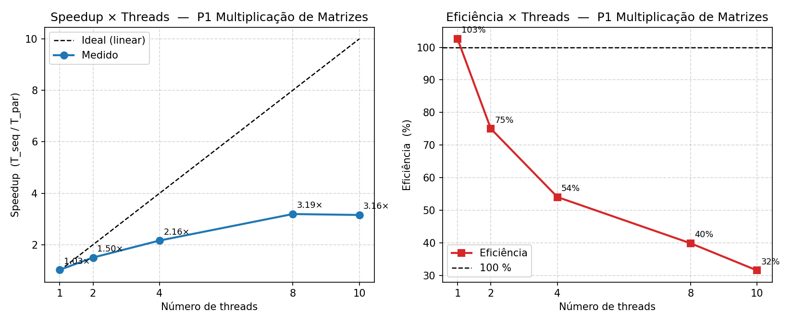

# LPII 2026.1 - Trabalho Pratico 1

## Identificacao
- Nome: Miguel de Queiroz Fernandes Soares
- Matricula: 20240008109

## Problema escolhido
**P1 - Multiplicacao de matrizes (n x n).**

O programa calcula `C = A x B` com a implementacao sequencial e com pthreads.
Na versao paralela, cada thread recebe um bloco de linhas de `C`, sem escrita concorrente na mesma posicao.
O codigo mede apenas a regiao de computacao com `CLOCK_MONOTONIC`, descarta a primeira execucao (aquecimento) e calcula media.
Ao final, compara resultado sequencial e paralelo com tolerancia para ponto flutuante (`1e-6`) e imprime `OK` ou `FALHA`.

## Estrutura
```text
.
├── CMakeLists.txt
├── README.md
├── results/
│   └── speedup.png
├── scripts/
│   └── plot_speedup.py
└── src/
    └── main.c
```

## Compilacao

### Opcao 1 - CMake
```bash
cmake -B build -DCMAKE_BUILD_TYPE=Release
cmake --build build
```

### Opcao 2 - comando unico gcc
```bash
gcc -O2 -Wall -Wextra -pthread src/*.c -o lp2_p1 && ./lp2_p1 4
```

## Execucao
Formato:
```bash
./lp2_p1 <threads> [n] [runs]
```

Exemplos:
```bash
./lp2_p1 4
./lp2_p1 8 1200 6
```

- `threads`: numero de threads da versao paralela (obrigatorio)
- `n`: dimensao da matriz (`n x n`, padrao `1000`)
- `runs`: numero total de execucoes (padrao `6`, primeira descartada)

## Saida esperada
O programa imprime:
- `T_seq medio`
- `T_par medio`
- `Speedup (T_seq/T_par)`
- `Checksum` das duas versoes
- validacao automatica (`OK`/`FALHA`)

## Ambiente de teste
- CPU: Intel Core i7-1255U (12th Gen) — arquitetura hibrida: 2 P-cores + 8 E-cores
- Nucleos fisicos/logicos: 10 / 12
- Sistema operacional: Windows 11 Pro 10.0.26200
- Compilador: GCC 15.2.0 (MSYS2/ucrt64)
- Flags: `-O2 -Wall -Wextra -pthread`
- Dimensao usada nas medicoes: n = 1000, 6 execucoes (primeira descartada), media de 5

## Tabela de resultados (Q3)

T_seq = 2.352 s (media de 5 execucoes, versao sequencial pura).
Speedup calculado pelo programa como T_seq / T_par medidos na mesma execucao.

| Threads | T_par (s) | Speedup |
|---|---:|---:|
| 1 (seq) | 2.352 | 1.00x |
| 2 | 0.985 | 1.50x |
| 4 | 0.794 | 2.16x |
| 8 | 0.524 | 3.19x |

## Q4 - Estudo de escalabilidade (extra)

### Tabela completa

| Threads | T_par (s) | Speedup | Eficiencia |
|---|---:|---:|---:|
| 1 | 2.293 | 1.03x | 103% |
| 2 | 0.985 | 1.50x | 75% |
| 4 | 0.794 | 2.16x | 54% |
| 8 | 0.524 | 3.19x | 40% |
| 10 | 0.581 | 3.16x | 32% |

> T_seq de referencia: 2.352 s. Eficiencia = Speedup / numero de threads.

### Grafico



Para gerar o grafico novamente:
```bash
python scripts/plot_speedup.py
```

### Discussao

O speedup cresce de forma sublinear e satura em torno de 3.2x, mesmo com ate 10 threads
disponiveis. Tres fatores explicam esse comportamento. Primeiro, a **Lei de Amdahl**: existe
uma parcela sequencial inevitavel no programa (criacao e juncao das threads, validacao dos
resultados, impressao), que impos um teto ao speedup maximo independentemente do numero de
threads. Segundo, o **overhead de criacao e juncao de threads**: a cada medicao o programa
chama `pthread_create` e `pthread_join` T vezes; esse custo fixo por execucao cresce com T e
reduz o ganho liquido, especialmente visivelmente entre 8 e 10 threads. Terceiro, a
**arquitetura hibrida P/E-cores do i7-1255U**: o processador possui 2 P-cores rapidos
(com Hyper-Threading) e 8 E-cores mais lentos (sem HT). A partir de 8 threads todos os
nucleos fisicos ja estao ocupados; acrescentar mais threads distribui trabalho entre P-cores
ja sobrecarregados via HT e nao agrega velocidade, o que explica a leve queda de speedup de
3.19x (8 threads) para 3.16x (10 threads). A eficiencia cai de 75% com 2 threads ate 32%
com 10 threads, refletindo esse esgotamento progressivo do paralelismo util.
